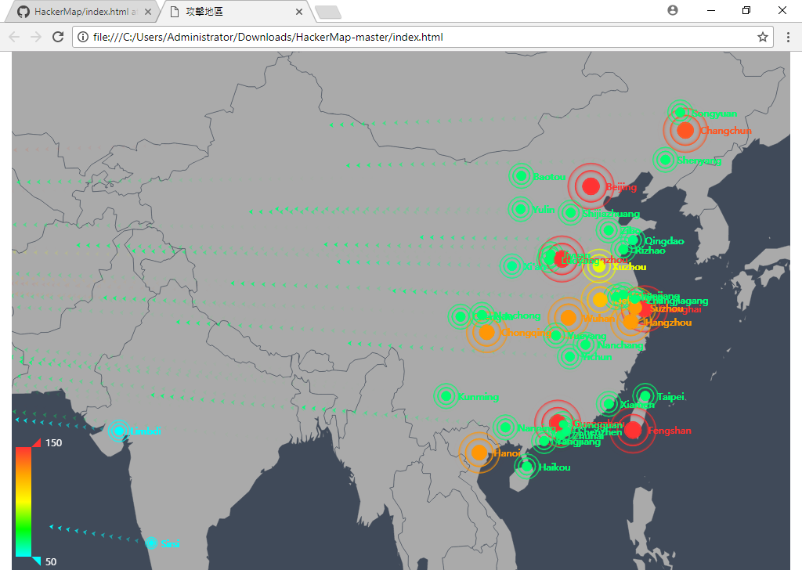

# HackerMap



## MSSQL 連線設定
/src/mssqlTools.js
```
const config = {
    user: 'Geo',
    password: 'Pa$$w0rd',
    server: 'localhost',
    port: 1433,
    database: 'Location'
}
```

### Node js安裝套件
使用終端機，到專案底下，執行下面命令
```
npm i
```
所使用的套件，會安裝到node_modules內

### Run Node js程式碼
使用終端機，到專案底下，執行下面命令
```
node index.js
```

### 開啟網站
執行index.html
